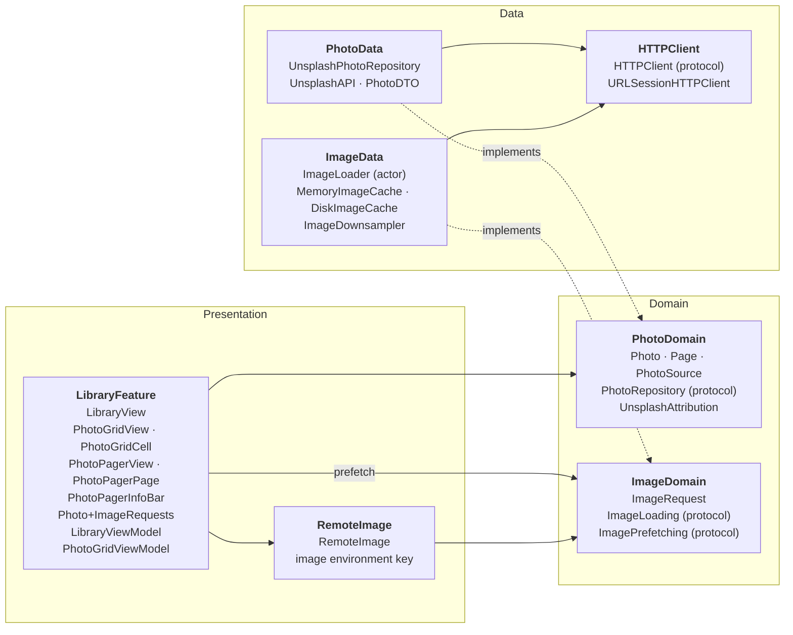
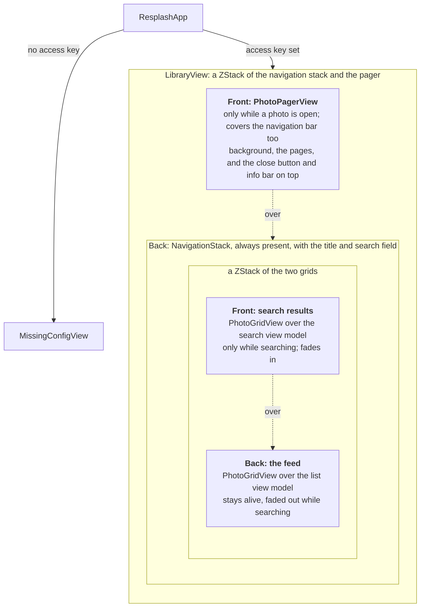
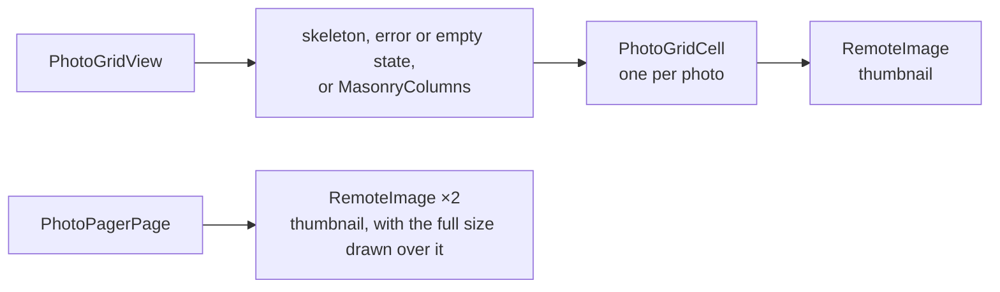
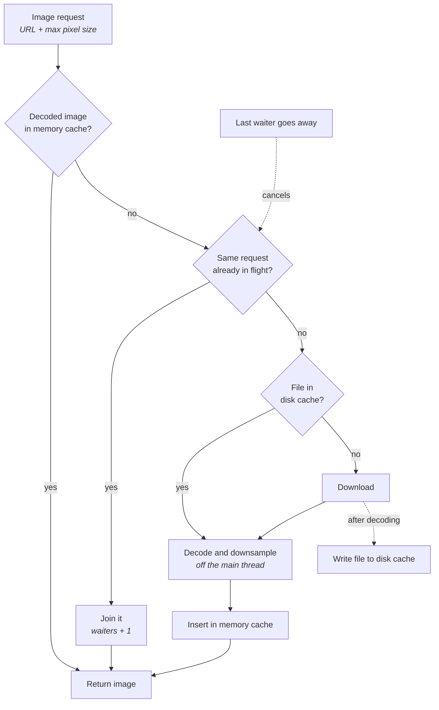

# Resplash

An iOS 16+ SwiftUI photo library backed by the Unsplash API: an endless Editorial feed, a full-screen pager, and search.

## Setup

Built and tested with Xcode 27.

1. Create an app at <https://unsplash.com/oauth/applications> and copy its **Access Key**.
2. `cp Resplash/Config/Secrets.example.xcconfig Resplash/Config/Secrets.xcconfig`, then open it from the `Config` folder in Xcode and paste the key.
3. Open `Resplash.xcodeproj` and run.

`Secrets.xcconfig` is gitignored and not in the app target. The key flows `xcconfig → Info.plist → Config`: it stays out of git, but it ends up in the built app's `Info.plist`, so it is not secret. A production app would proxy through a backend, as Unsplash's guidelines ask. Without a key the app shows an in-app message instead of crashing.

## Architecture

Feature-based MVVM with a repository, and no use-case layer: there is no business logic to put in one. Everything points toward the domain (`PhotoDomain` and `ImageDomain`).

Arrows point to what a module depends on; dotted arrows are an implementation of a protocol the domain owns. Photos and images share one shape: a protocol in the domain, its implementation in the data layer, so the views never see `Unsplash*`, `URLSession` or `ImageLoader` and each side can be faked in tests. `ResplashApp` builds the concrete types and is the only code that knows them (`Config` reads the access key). `RemoteImage` knows nothing of photos, so it could live in a separate UI library.

### View hierarchy

The screen is a stack of layers. Nothing is swapped out: the pager appears over the navigation stack, and search results fade in over the feed. What is underneath stays alive, which is why closing the pager or clearing a search returns to exactly where you were. Dotted arrows read "is drawn over".

Each grid and each pager page is built from smaller views:

Both grids are the same `PhotoGridView` over different view models. Only the current page and its two neighbours exist in the pager, so a long feed does not hold hundreds of live image views.

- **View models:** `ObservableObject` and `@Published`, because `@Observable` needs iOS 17. View models are `@MainActor`, with async/await.
- **One grid view model per source.** `PhotoGridViewModel` owns paging (state enum, generation token so a stale response never lands in a newer list, an in-flight guard, de-duplication by photo ID, a footer retry for failed later pages). `LibraryViewModel` keeps a list view model for the whole session and makes a fresh one per search, so clearing a search returns to the list instantly with its scroll position and no requests. Search is debounced by 350 ms.
- **Cells take values, not view models.** `PhotoGridCell` is `Equatable`, so one change does not re-render every cell. Layout is reserved from each photo's aspect ratio, with its dominant colour as the placeholder.
- **Hero transition.** `matchedGeometryEffect` between grid cell and pager page, in an overlay rather than a navigation push (the zoom transition needs iOS 18). The pager is hand-rolled rather than `TabView(.page)`, which ignores SwiftUI transactions and so cannot fly the selected photo in. It owns its current page, so paging does not re-evaluate the grid underneath; the grid is scrolled to the page after a pause, and its cell swaps its image only when the pager closes.

### Image pipeline

There are no third-party packages: the loader is built on `URLSession`, ImageIO, `NSCache` and files. `ImageLoader` is an actor behind a protocol. A request looks in the decoded **memory cache** (`NSCache`, bounded by bytes), then joins any **download already in flight** for the same request, then reads the **disk cache** (files keyed by URL hash, least recently used evicted), then goes to the network. Images are decoded and downsampled with ImageIO off the main thread.

- **De-duplication:** requests for one image share one load.
- **Cancellation is reference-counted.** A cell scrolling away cancels the load only when no other request is waiting on it.
- **Prefetching:** as cells appear the grid view model asks for the next 8 thumbnails, and the pager's for the pages two away. Views only report what appeared; the view models decide what to load. Each call replaces the previous window and cancels loads that fell out of it.
- **No second cache:** the loader's session has no `URLCache`, so nothing is stored twice.

## User experience

- **Loading.** While the first page loads the grid shows a skeleton of grey placeholder columns, and the search results show the same until the debounce fires. Each cell reserves its final aspect ratio and shows the photo's dominant colour, so the layout does not jump and an image arrives in place of a block of roughly the right colour.
- **Failures are local where they can be.** A failed image shows a small photo icon in its cell and is tried again the next time the cell appears. A failed *later* page leaves everything shown and puts a message and **Retry** under the grid. Only a failed *first* page replaces the screen, with an icon, a plain explanation and **Try Again**; being offline and hitting the rate limit have their own wording.
- **Empty states** say what happened: "No photos", or "No results for “query”".
- **Search** is always available, waits 350 ms after the last keystroke before asking the API, and drops requests it superseded. Clearing it returns to the feed instantly, at the same scroll position, with no request.
- **Opening a photo** flies the cell's image up to full screen and back. In the pager a horizontal swipe moves exactly one photo, a vertical drag dismisses it (the background fades and the photo shrinks as you go), and the neighbouring photos' images load before you arrive. The thumbnail the grid already has sits under the full-size image, so a page is never blank while it downloads.
- **Responsiveness.** Decoding and downsampling run off the main thread and the image loader never blocks on them. Prefetching starts the next 8 thumbnails as you scroll and is cancelled for what you passed. On an iPhone 13 Pro the scripted scroll, scroll back and swipe through the pager measured 0.7 to 2.1 ms/s of hitch time (see Performance); that is a measurement of one scripted run, not a claim about every device.
- **Accessibility.** Each grid cell is one VoiceOver element with the photo's caption, the viewer's close button is labelled, and the skeleton announces "Loading photos".

## Performance

Measured with one scripted scenario, the same every run, on an iPhone 13 Pro with a Release build: cold launch on a recorded 577-photo feed, scroll down until 300 photos are loaded, scroll back to photo 100, open the pager and swipe 20 pages. The image loader is compared with plain `AsyncImage` (no prefetching) in the same build, using Instruments and counters in the app. The harness is not in `main`: it is on the `performance-profiling` branch, whose `docs/perf/results/` holds a text summary of every trace (Time Profiler, Allocations and Animation Hitches for each mode, and the counters). Method, per-phase results and how to repeat them are in [docs/PERFORMANCE.md](docs/PERFORMANCE.md).

| Criterion | Image loader | `AsyncImage` | Evidence |
|---|---|---|---|
| Behaviour after several hundred images | Memory live at the end 141.7 MB, of which 116.6 MB is decoded images held in a 100 MB cache; bounded, not growing | 47.6 MB | Allocations |
| Efficient loading, no duplicated work | 347 downloads for 316 distinct images; scrolling back over about 150 cells: 0 downloads, 71 disk reads | 466 requests for the same 316; scrolling back: 147 requests | Loader counters; unit test |
| Unnecessary SwiftUI updates | One cell `body` per cell appearance (444 for 307 photos); the grid ran 4 times during the whole pager phase | Identical (448, 4) | `body` counters |
| Scroll smoothness | 2.1 ms/s hitch time scrolling, 0.7 ms/s in the pager | 1.3 and 1.5 ms/s | Animation Hitches |
| CPU | 50.4 s process CPU over the run, 43.8 s of it on the main thread | 51.4 s and 44.0 s | Time Profiler |

Both are well inside the 5 ms/s that Apple rates as good. The CPU is the same: nearly all main-thread time is in SwiftUI, UIKit and the runtime, and the app's own functions are under 0.5% of it.

**Trade-offs.**
- **Memory for decodes.** The loader holds about three times the baseline's live memory, capped at 100 MB of decoded images. Scrolling back over 147 cells re-decoded 71 of them from disk (about half) and downloaded nothing; the other 123 requests were served from memory. I chose bounded memory over fewer decodes because decoding runs off the main thread, so a re-decode costs CPU time but not a main-thread stall by design, and because unbounded growth risks the app being killed in the background. The traces show low hitch time in both modes; they do not isolate what decoding cost.
- **Cancelling costs downloads.** About 9% of downloads (31 of 347) are repeats of loads that were cancelled by scrolling away and later requested again (27 cancelled loads in the run).
- **`RemoteImage` re-evaluates more** (637 `body` runs against 494), most likely because it publishes its load state as `@State`; they are small leaf views. I did not isolate the cause.
- **The pager runs its `body` about 16 times per swipe** (324 over 20 swipes), most likely once per frame of the drag. It is the largest body count within the pager phase; over the whole run `PhotoGridCell` is larger (444).

## Tests

No test needs a network or an access key.

**Unit tests** cover the mapper and its fallbacks, the repository's error and rate-limit mapping, grid pagination and stale-response handling, search debounce, what each view model asks to be prefetched (with a recording fake), and the image loader: shared downloads, reference-counted cancellation, memory and disk hits, prefetch replacement, downsampling, and 500 photos asked for repeatedly downloaded exactly once.

**UI tests** run the main flows with real touches against a fixed set of eight photos: the feed loads, a photo opens with its photographer, swiping moves to the next photo, closing returns to the grid, search narrows the grid, and a search with no matches shows a message. The photos are defined in the test target and passed to the app as JSON in the launch environment; with `-ui-testing`, the composition root serves them through `InjectedPhotoRepository` instead of calling the API, so the app holds no fixture data.

## Potential improvements

### Offline mode

Not built, but the seam for it exists: the view models depend only on the `PhotoRepository` protocol, so offline is a decorator in the data layer and needs no change to views or view models.

1. **Persist pages.** A `CachingPhotoRepository` wraps `UnsplashPhotoRepository`, conforms to `PhotoRepository`, and writes each successful `Page<Photo>` to disk keyed by source and page number. `Photo` is not `Codable` today, which keeps persistence out of the domain, so the store has its own `Codable` record and maps to and from `Photo`. JSON files in Application Support are enough (SwiftData needs iOS 17, and a few hundred photos is small).
2. **Read through on failure.** On `PhotoRepositoryError.network`, which the app already tells apart from rate limiting and bad responses, return the stored page for that source and page if there is one, and otherwise rethrow so today's error and retry states appear. A first launch with no network and nothing stored still shows "You're offline".
3. **Refresh when online.** Show the stored first page immediately, request page 1, and replace the list when it differs (de-duplication by photo ID already exists). Pages of a moving feed can drift out of step with each other, so a refresh replaces the whole stored feed from page 1 instead of patching single pages.
4. **Images.** `DiskImageCache` already persists them (200 MB, least recently used first), so any photo whose thumbnail was seen is on disk. Two changes: keep the stored pages' thumbnails from being evicted by browsing full-size images (a separate budget for full-size), and treat an image that cannot load offline as "not here yet" and leave the colour placeholder, not show a failure icon on every cell.
5. **Telling the user.** A small "Offline, showing saved photos" banner driven by `NWPathMonitor`, and a reload when connectivity returns. The footer retry stays for pages that were never stored.
6. **Tests.** The same shape as the existing repository tests: a fake inner repository that fails and a stored page that is returned; a page that was never stored still errors; a refresh replaces the stored feed; stored data from an older schema is discarded, not crashed on.

The costs: stored photos can be stale or deleted upstream, search results are not covered unless stored per query, and the store needs a size cap and a schema version.

### Other

- **Fewer repeated downloads.** About 9% of downloads were loads cancelled by scrolling away and then asked for again. A short grace period before cancelling would let a cell that comes straight back keep its load, at the price of holding bandwidth a little longer.
- **Fewer pager updates.** `PhotoPagerView` evaluates its `body` about 16 times per swipe. Moving the drag state into a child view would limit that to the subtree that actually moves.
- **Cache sizing.** The 100 MB memory cache is fixed. It could scale with the device's memory and shrink on a memory warning.
- **Measurements.** Three runs per mode would give a spread, which would show whether the small hitch and CPU differences are real.
